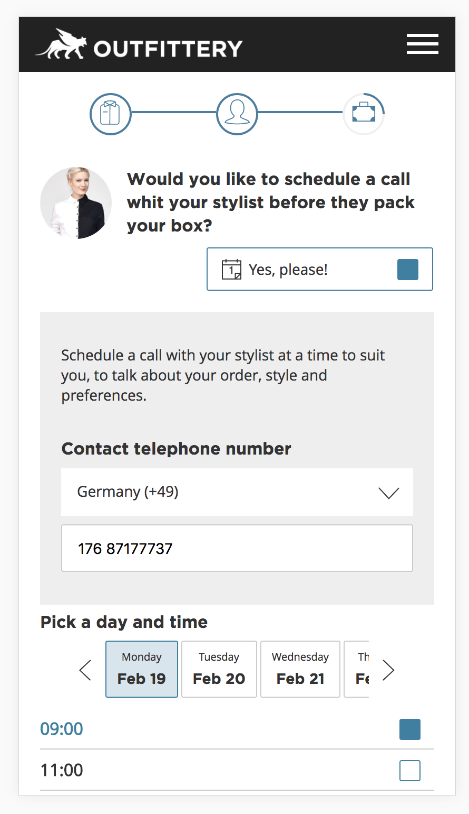

# Stylist Schedule

> A Stylist Schedule biuld with Angular

[Demo](https://dist-aexlrbwhqv.now.sh)

## Development server

Run `ng serve` for a dev server. Navigate to `http://localhost:4200/`. The app will automatically reload if you change any of the source files.

## Running unit tests

Run `ng test -sm=false` to execute the unit tests via [Karma](https://karma-runner.github.io).
